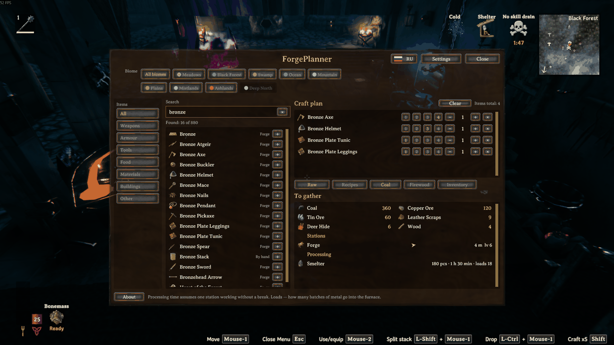
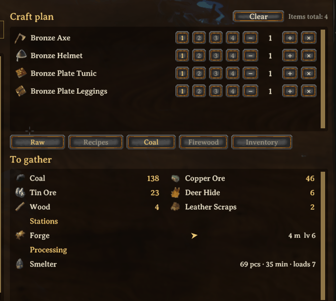
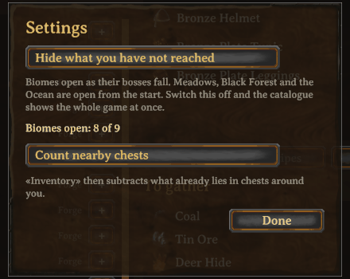
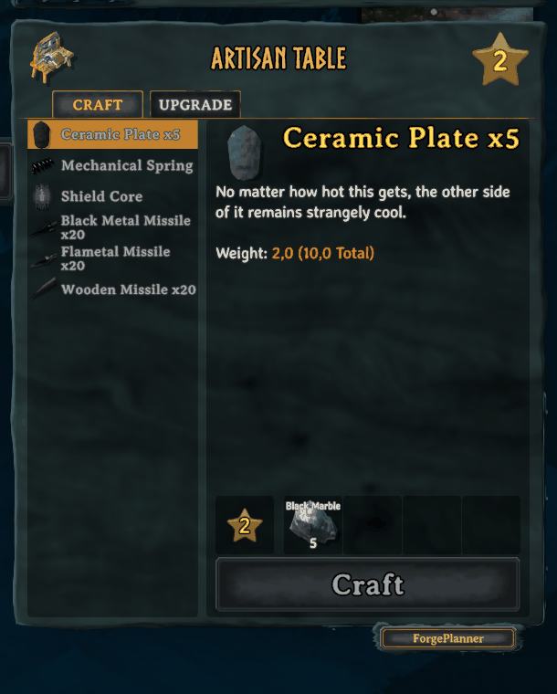
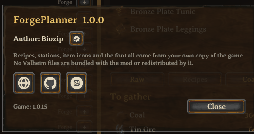

# ForgePlanner

A crafting planner that lives inside Valheim. Press **F7**, build a shopping
list, and see exactly how much ore, wood and hide it takes — including the
smelting, the coal, and which station you have to stand at.

Everything is read from your running game: recipes, upgrade costs,
conversions, item names, icons, trader price lists and your language. Nothing
about the game is hardcoded, so the numbers keep matching after a patch instead
of going quietly stale.

Latest release: **1.0.0**. Requires
[BepInExPack_Valheim](https://thunderstore.io/c/valheim/p/denikson/BepInExPack_Valheim/)
(denikson) — BepInEx 5.4.x. Tested against Valheim 1.0.15.

There is a companion website, [forgeplanner.pages.dev](https://forgeplanner.pages.dev),
which runs the same calculation in a browser. The two are kept honest about
each other; see [Relationship to the website](#relationship-to-the-website).



## What it does

- **Plan several items at once.** Three bronze picks and two maces, not one
  item at a time. Double-click a catalogue row to add it.
- **Quality levels 1–4.** The upgrade surcharge comes from the game, not from a
  guess. Valheim doubles it per level (1, 2, 4), which is where most
  spreadsheets and wikis get it wrong.
- **Raw materials or recipe materials.** Either break everything down to ore,
  wood and hide, or stop at what the workbench actually asks for.
- **Smelting included.** Coal, smelting time, and how many loads each station
  needs.
- **Counts what you already have.** Your inventory plus nearby chests.
- **Tells you which stations the plan needs** — whether one is standing nearby,
  how far, in which direction, and at what level. If yours is too low, it says
  which level is wanted. If there is none, one button adds the station itself
  to the plan.
- **Names the trader for anything that drops nowhere,** with the price.
- **Buildings too.** Walls, floors, workstations — the hammer menu is in the
  same catalogue.
- **Filter by biome,** with the same colours as the website.
- **Search in English and Russian,** whichever language the game is running in.

The window borrows the game's own font, panel and button art at runtime, so it
matches your UI scale and your language.



Quality levels on the left of each row; then everything the plan costs, the
stations it needs with distance and direction, and what has to go through a
smelter or a kiln first.

### Spoiler-free by default

A planner opened in your first hour would otherwise retell the whole game: a
thousand entries with flametal weapons at the top. So a biome stays locked
until the boss before it falls. Meadows, Black Forest and Ocean are always
open — you get there on your own.

Locked biomes dim rather than disappear; a vanishing row of buttons reads as a
fault. It is one switch in Settings if you would rather see everything, and if
you have already beaten the bosses you lose nothing.

The victory keys are read from the boss prefabs themselves
(`Character.m_defeatSetGlobalKey`) at world load, so the mod carries no list of
boss names for a future update to invalidate silently. Only one thing is fixed:
which victory opens which biome. That is knowledge about the game, not about
its files, and it cannot be derived from the data. A boss whose key the mod does
not recognise is logged by name.



## Installing

1. Install [BepInExPack_Valheim](https://thunderstore.io/c/valheim/p/denikson/BepInExPack_Valheim/).
2. Drop `Forgeplan.dll` into `BepInEx/plugins/`.
3. Press **F7** in a loaded world, or use the **ForgePlanner** button on any
   crafting station's panel.

The cursor is released while the window is open, and the game behaves exactly
as it does when you press `E` at a workbench: no swinging, building, walking or
hotbar switching by accident. Press **F7** or **Esc** to close.



The button sits on a shelf of its own below the crafting panel. A third tab
next to Craft and Upgrade is not possible: the game places those tabs by
numbers rather than layout, and a third one lands differently for everyone
because UI scale is adjustable.

## Configuration

`BepInEx/config/dev.forgeplanner.forgeplan.cfg`, written on first run.

| Section | Key | Default | Meaning |
| --- | --- | --- | --- |
| `General` | `Open` | `F7` | Hotkey that opens the planner |
| `General` | `Russian` | `false` | Window labels in Russian |
| `General` | `HideUnreached` | `true` | Lock biomes until their boss is beaten |
| `Stock` | `CountChests` | `true` | Count nearby chests, not just your backpack |
| `Stock` | `Radius` | `20` | How far a chest counts as yours, in metres |
| `Station` | `Button` | `true` | Show the ForgePlanner button on station panels |
| `Station` | `Corner` | `BottomRight` | Which side of the panel the button's shelf sits on |
| `Station` | `OffsetX` | `14` | Shelf offset from the panel edge, in points |
| `Station` | `DropDown` | `0` | How far below the panel edge to drop the shelf |
| `Debug` | `SelfTest` | `false` | Dump the parsed catalogue to the log on world load |

The three `Station` keys exist for repair rather than taste: the crafting panel
belongs to the game, and a future Valheim update may move it. If the button
ends up in the wrong place it can be put back without a new release.

## Where the data comes from

One source: the running game.

| The website needs | The mod uses |
| --- | --- |
| JotunnDoc dumps, `build_data.py` | `ObjectDB.instance.m_recipes` |
| conversions extracted from the game bundle | `GetComponent<Smelter>()`, `<Fermenter>()`, `<CookingStation>()` |
| an icon atlas, hand-mapped names, wiki fallbacks | `m_shared.m_icons[0]` |
| a two-language dictionary kept in parity by hand | `Localization.instance.Localize` |
| a generated `data.js` pinned to one game version | updates itself along with the patch |

**No Iron Gate asset is redistributed.** Icons, fonts and names are read from
the player's own installed game. The only images inside the DLL are five link
icons drawn for this project; `LICENSE` says which.

### The two exceptions

Two files under `src/` are generated rather than read from the game, and both
have a reason:

- **`Tiers.g.cs`** — the biome table. There is no biome on an item anywhere in
  the game's data, neither on `ItemDrop` nor on `Piece`. It is editorial
  knowledge. Retyping it here by hand would mean drifting from the website at
  the first correction, so it is generated from the site's data instead.
- **`Names.g.cs`** — item names in both languages. The game knows exactly one
  language at a time and will not hand over the other, so searching for "лук"
  on an English install would find nothing, and the language switch could not
  rename items.

Both are committed, so the mod builds and runs without the website. The
dependency only exists when the data is rebuilt, and it is one-way: the site
writes into the mod, never the reverse.

## Building

```bash
dotnet build -c Release
```

Produces `bin/Release/Forgeplan.dll` (about 300 KB), zero errors, zero
warnings. You need the .NET SDK, an installed copy of Valheim, and network
access once, for the publicizer package from NuGet.

References are taken from the installed game and from installed BepInEx —
neither may be committed to this repository. If Valheim is not on the default
Steam path:

```bash
dotnet build -c Release -p:ValheimDir="D:\Games\Valheim"
```

If BepInEx is not installed into the game, put `BepInEx.dll` and `0Harmony.dll`
from BepInExPack_Valheim into `lib/`; the build error says as much.

`install.ps1` copies the built plugin into the game. It checks first whether
Valheim is running: while the process is alive BepInEx holds `Forgeplan.dll`
open, and the copy fails with "Permission denied" — an error that looks like a
Program Files permissions problem and sends you the wrong way.

```powershell
.\install.ps1 -Wait -SelfTest
```

**Start the game through Steam only.** Launching `valheim.exe` directly, even
with `steam_appid.txt` beside it, makes characters and worlds appear to vanish:
they live in Steam Cloud (Connected Storage), and outside the client the game
can list them but not read them. Nothing is actually lost, but the fright costs
more than the convenience.

### Packaging

```bash
python make_icon.py     # icon.png, 256x256
dotnet build -c Release
python package.py       # dist/ForgePlanner-X.Y.Z.zip
```

The archive holds `manifest.json`, the icon, the English `pack/README.md` and
`pack/CHANGELOG.md`, `LICENSE` and the plugin. The version number is not
duplicated anywhere by hand: `VERSION` → `Version.g.cs` → `[BepInPlugin]`, and
`VERSION` → `manifest.json`. Both building and packaging refuse to run if
`VERSION` disagrees with the top entry of `Versions.md` — a release with no line
in the history is unidentifiable a month later.

The icon is drawn in code rather than taken from the game, for the same reason
as everything else here.

## Self-test

Loading and working are different things. The catalogue is built lazily, on the
first time the window opens, and on success it prints nothing — silence in the
log looks the same whether all is well or the window was never opened.

So `[Debug] SelfTest = true` makes the mod dump, on entering a world:
catalogue sizes, the station list with localised names, the whole conversion
table, which recipes were dropped as duplicates and why, how many Potential
Forge idols were discarded, the raw per-level cost curve straight out of
`ObjectDB`, and a handful of fully calculated orders.

It is off by default; an ordinary player does not need fifty lines on every
world load. It adds no Harmony patches — it runs from `Update()` the first time
the catalogue builds.

This doubles as the regression test after a game patch, and as the input for
`parity.js` on the website side.

## Client-side only

Not a promise — a checkable fact. These are all the game types the compiled
`Forgeplan.dll` refers to at all, taken from the assembly's TypeRef table:

```
Character  Console  Container  CookingStation  CraftingStation  Fermenter
Game  GameCamera  Humanoid  Inventory  InventoryGui  ItemDrop  Localization
Menu  Minimap  ObjectDB  Piece  PieceTable  Player  PlayerProfile  Recipe
Smelter  TextViewer  Trader  Version  ZNetScene  ZNetView  ZoneSystem
```

Sending anything over the network in Valheim requires `ZRoutedRpc`, `ZNet`,
`ZPackage`, `ZDO` or `ZSteamSocket`. **None of them is in that list.**
`ZNetView` is there because `Container.m_nview` is typed that way, and the only
method called on it is `IsValid()`. `ZoneSystem` is used for one read,
`GetGlobalKey`, to find out which bosses are down.

From `System.IO` the assembly uses `Stream` and `MemoryStream` only, to read its
own embedded icons out of the DLL. No file and no network type appears
anywhere.

Eleven Harmony patches, all of them about this mod's own window:

| Patch | Why |
| --- | --- |
| `InventoryGui.IsVisible` | while the window is open, answer `true` — the game then blocks input itself, exactly as at a workbench |
| `InventoryGui.Show` | add the ForgePlanner button's shelf under the crafting panel |
| `Player.SetControls` | zero out movement, attack, block, jump, dodge |
| `Player.PlayerAttackInput` | do not swing while the window is open |
| `Player.UpdatePlacement` | do not place a wall by clicking a button in the window |
| `Player.UseHotbarItem` | the digits belong to the window, not to the hotbar |
| `Player.UpdateCrouch` | same, for crouch |
| `Player.StartGuardianPower` | same, for the guardian power |
| `GameCamera.UpdateCamera` | freeze the camera; the game reads the scroll wheel past the UI |
| `GameCamera.UpdateMouseCapture` | do not take the cursor back |
| `ZNetScene.Shutdown` | drop the cached catalogue when leaving the world |

None of them touches the world, a save or a character. Ten suppress input while
the window is on screen; the eleventh clears this mod's own cache. The
per-`Player` patches check the player is yours — in a multiplayer world there
are as many `Player` instances as there are people on the server, and an
earlier version of this suppressed *other people's* emotes.

## Known gaps

**Cooking station preference.** `GameData.Put` takes the first conversion it
finds, and prefab order in `ZNetScene` is not guaranteed. Meat cooks on both
the plain rack and the iron one, so without an explicit preference table
Meadows boar may end up asking for the iron one. The metals already have such a
table, `GameData.Prefer`, mirrored in the site's pipeline: iron from scrap,
copper from ore. There is no marker in the data saying which rule is right —
that is always a human decision, so both sides keep it written down with the
reasoning.

**Frost Foundry.** 28 Deep North casting conversions are shadowed by ordinary
recipes. For bronze that rule is obviously correct; here it is not, and it can
only be checked by hand in the Deep North. For now the mod behaves like the
site: it takes the recipe, and the foundry does not appear in plans.

**No shareable links.** `#p=1&i=spearflint*3` does not exist inside the game.
The nearest replacement would be copying the list to the clipboard.

## Relationship to the website

[forgeplanner.pages.dev](https://forgeplanner.pages.dev) is the same
calculation in a browser, for planning before you launch the game. The site
reads extracted game data; the mod reads the live game. They must agree, and a
parity harness compares the catalogue, the conversions and the per-level costs
entry by entry, using the self-test log as its input.

Four real calculation bugs were found that way in a single day: potential idols
counted as ingredients, bronze taken from scrap instead of ore, a five-ingot
recipe beating the one-ingot one, and a wrong upgrade curve. All four were
fixed on both sides.

Progression is the one thing the site cannot do: it does not know which bosses
you have beaten.

## Release history

`Versions.md` in this repository, in Russian — it records not only what changed
but why, including the times a decision turned out to be wrong. The English
summary that ships with each release is `pack/CHANGELOG.md`.

Releases before 1.0.0 predate this repository and exist only as entries in
those files.



## Licence

MIT — see `LICENSE`. Not affiliated with Iron Gate Studio or Coffee Stain
Publishing.

The screenshots in `media/` show the mod's window inside the running game, so
they necessarily show Valheim's own interface around it. They are here to
document the mod; the game and its art remain Iron Gate's.
